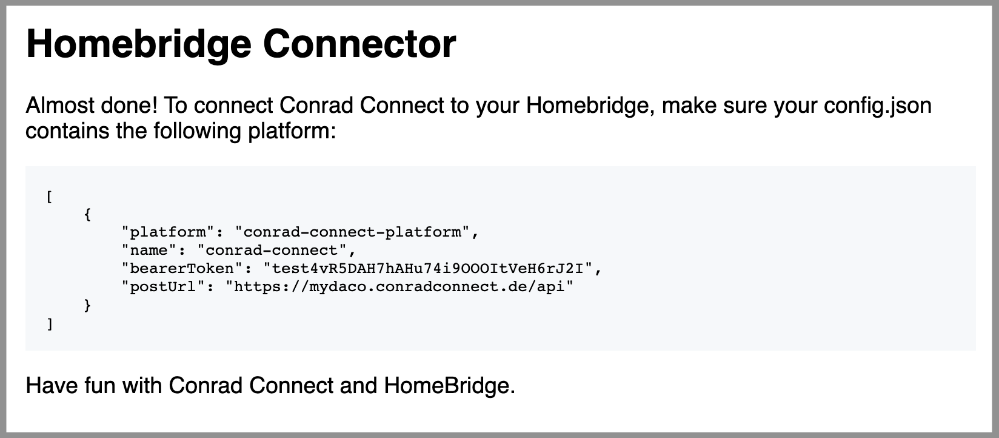

# homebridge-conrad-connect

This plugin makes all devices in your [Conrad Connect](conradconnect.de) account available in HomeKit on your iOS device. Currently restricted to lamps.

--> BILD

## Setup

1. Install `homebridge-conrad-connect` like you would install any other Homebridge plugin:

```shell
npm install -g homebridge-conrad-connect
```

2. Go to Conrad Connect, install the homebridge-connector (LINK) service and click configure to retrieve your configuration.



3. Enter the values you just retrieved into your `config.json`.
